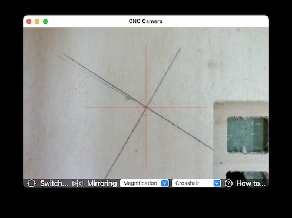
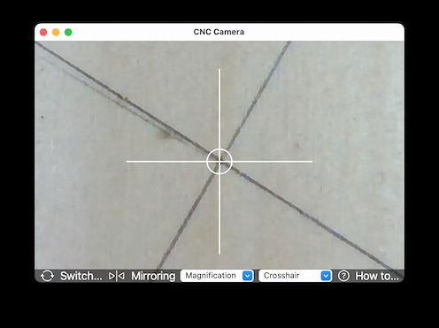

# CNC-Camera
## Objective
CNC Camera is a simple Mac program to facilitate marking the zero point for a CNC router like cnc14.de. It presents a window displaying the feed of a camera attached to the router, overlaid with a crosshair. The program is based on an example from Apple: [Capturing and Saving a Photo](https://developer.apple.com/tutorials/sample-apps/capturingphotos-captureandsave).
## Technical
CNC Camera requires Mac OSX 11.x or higher and is a 'universal app' for older Macs with Intel processors as well as recent machines with an Apple M processor. The program is available as a standard Mac (DMG) Installer, double click and 'go'. The buttons at the bottom of the screen will look slightly different on older versions of OSX but functionality is always the same.

All USB cameras are suitable. The CNC14 camera has been designed specially to be easily attached to the Z-axis of your router. More information on [CNC14.de](https://www.cnc14.de/schaufenster/kamera-zum-ausrichten).
## Screen images
 

The first image shows a red crosshair and a magnification of 1x, the second one a white crosshair with a magnification of 2x.The diagonal cross was drawn on the material with a fine pencil.
## How to use
You should first connect your CNC router USB-camera to your Mac and then start CNC Camera. Theoretically you can connect multiple cameras although this is of little use.

**Select Camera:** The app will display the built-in camera of your Mac at startup. Use 'Select Camera' to cycle through all cameras until you find the CNC router camera.

**Mirroring:** A webcam will normally not be mirrored, i.e., the image moves to the left when you move the router to the right and vice versa. This is confusing and switching on 'Mirroring' will reverse the movement and provide a natural feel.

**Magnification:** You can switch magnification to 1x, 2x or 3x.

**Crosshair:** You can select the line width of the crosshair as well as the color for maximum contrast with the color of your material.

**How to use:** This button contains the text of this Readme.
